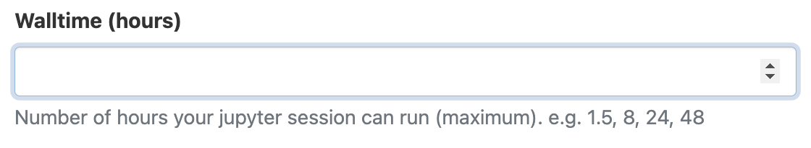
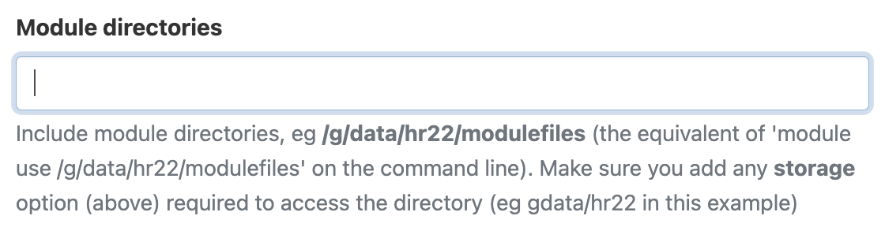
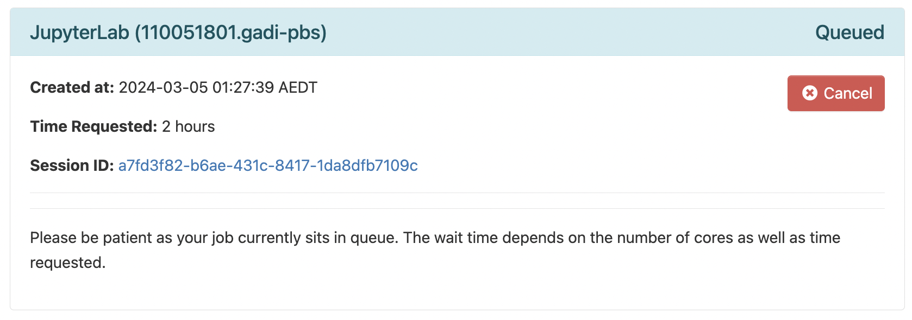

# Training day - ACCESS Workshop 2025

|Schedule | Description |
| --- | --- |
|1345-1415 | notebook presentation with overview on `esmvalcore` and tools used|
|1415-1430 | example ENSO climatology notebooks (use main, 01bias, 11ENSO amplitude)|
<<<<<<< HEAD
|1430-1500 | exercise notebook - change dataset?|
|1500-1515 | ESMValTool recipe format? - example multimodels/ensembles|
|1515-1530 | **Afternoon Tea**|
|1530-1600 | notebook presentation with ACCESS-MOPPeR, CMIP7 context|
|1600-1610 | run ACCESS-MOPPeR on ENSO variables demo|
=======
|1430-1500 | exercise notebook - change datasets?|
|1500-1515 | ESMValTool recipe format? - example multimodels/ensembles|
|**1515-1530** | **Afternoon Tea**|
|1530-1600 | notebook presentation with ACCESS-MOPPeR, CMIP7 fasttrack and ref|
|1600-1610 | run MOPPeR on ENSO variables demo|
>>>>>>> cf9254b (rename and add recipe example)
|1610-1620 | example ENSO notebooks comparing ESM1.6|
|1620-1640 | exercise notebook - update basic to read in spin-ups and run|
|1640-1700 | Code and share, feedback, discussion|

## Pre-requisites

Have an active NCI account.
Required NCI projects:
- Join project `xp65`
- Join project `nf33` (ACCESS-NRI training)
- Join the ACCESS-NRI replicated data collection for Model Evaluation project `ct11`
- Join CMIP6 projects: `fs38`, `oi10`

## Start ARE session:
## 1. Open ARE on Gadi
Go to the [Australian Research Environment](https://are-auth.nci.org.au/) website and login with your **NCI username and password**. If you don't have an NCI account, you can sign up for one at the [MyNCI website](https://my.nci.org.au).

<p align="center"></p>

## 2. Start JupyterLab App
Click on `JupyterLab` under *Featured Apps* to configure a new JupyterLab instance. This option is also available under the *All Apps* section at the bottom of the page and the *Interactive Apps* dropdown located in the top menu.

<p align="center"></p>

## 3. Configure JupyterLab session
You will now be presented with the main JupyterLab instance configuration form. Please complete **only** the fields below - leave all other fields blank or to their default values.

- *3.1* **Walltime**: The number of hours the JupyterLab instance will run. For the session please insert a walltime of `4` hours.

<p align="center"></p>

- *3.2* **Compute Size**: Select `Medium (4 cpus, 18G mem)` from the dropdown menu. 
    - - *If you want to run ACCESS-MOPPeR select `X-Large (24cpus, 95G mem)`*

<p align="center"></p>

- *3.3* **Project**: Please enter `nf33`. This will allocate SU usage to the workshop project.

<p align="center"></p>

- *3.4* **Storage**: In ARE, storage locations need to be explicitly defined to access these data from within a JupyterLab instance.
   Please copy and paste the following string in its entirety into the storage input field:
```
gdata/xp65+gdata/fs38+gdata/oi10+gdata/ct11+scratch/nf33
```

<p align="center"></p>

- *3.5* Click `Advanced options ...`
  * Optional: You can check the box here to receive an email notification when your JupyterLab instance starts, but as we are running a relatively small instance, it will likely spin up quickly so this probably isn't necessary.</p>

- *3.6* **Module directories**: To load the required environment modules, please copy and paste the following. This is equivalent to using `module use` on the command line.
```
/g/data/xp65/public/modules
```

<p align="center"></p>

- *3.7* **Modules** To load an environment with ESMValTool, please copy and paste the following. This is equivalent to using `module load` on the command line.
```
conda/analysis3
```

<p align="center"></p>

- *3.7* Click `Launch` to start your JupyterLab instance.


<p align="center"></p>

## 4. Launch JupyterLab session
Once you have clicked `Launch` the browser will redirect to the 'interactive sessions' page where you will see your JupyterLab instance details and current status which will look something like this:

<p align="center"></p>

Once the JupyterLab instance has started (this usually takes around 30 seconds), this status window should update and look something like the following, reporting that the instance has started and the time remaining. More detailed information on the instance can be accessed by clicking the `Session ID` link.

<p align="center"></p>

Click `Open JupyterLab`. This opens the instance in a new browser window where you can navigate to the location of the files.

## Clone repo in Gadi
Open a terminal and `cd` to working folder.
<p align="center"></p>

`git clone https://github.com/ACCESS-NRI/ACCESS-ENSO-recipes.git`

### Other learning resources
Some details may be out of date with most recent software but can be helpful for some background.

- previous hackathon day https://access-nri.github.io/CMIP7_MED_Hackathon/index.html
- videos https://www.youtube.com/playlist?list=PLFjfi2xLaFpJp59LvDc1upQsj_xzFlFLc
